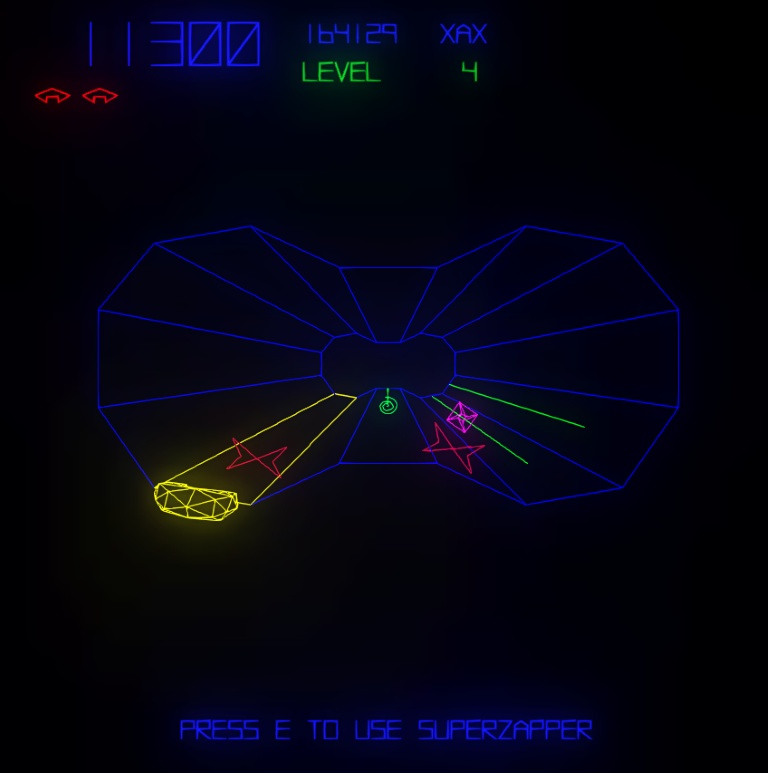
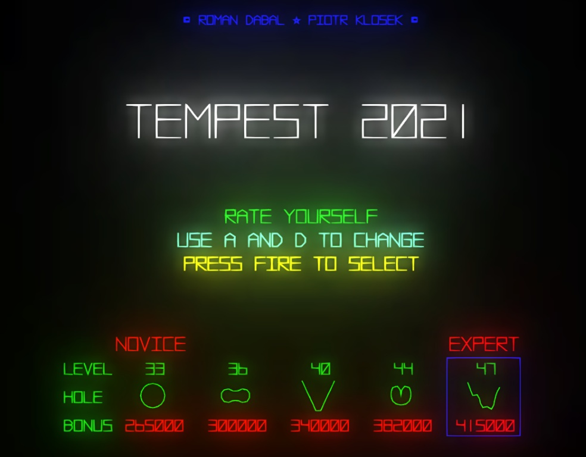

# Tempest 2021

Tempest 2021 is a remake of Tempest, an arcade game from 1981 published by Atari.
Remake has been created as a university project at a University of Silesia (Uniwersytet Śląski).

This project was created in cooperation with [Piotr Kłosek](https://github.com/Peterka15).

# Play online!
You can play Tempest 2021 online, just [click here](https://dabalroman.github.io/tempest2021/).

Use `A` and `D` to move around, press `Space` to fire.
There is one-time super-weapon called Superzapper - you can use it with `E`.

Game remembers your progress, so after losing one battle you can jump right into another one with same difficulty level.
It's safe to close browser, your high-score won't be gone.

Project is available to play online thanks to GitHub Pages.

# About Tempest 2021
## Technical stuff
Project uses three.js as a rendering library. It was written purely in JavaScript.
It's based on vue webpack config, so it can be developed, served and built without any hustle.

## Licensing
All sounds used in Tempest 2021 comes from freesound.org and are published on free-to-use licences.
The VectorBattle font comes from fontspace.com and is published as Non-Commercial freeware.
All other assets were created in-house.
